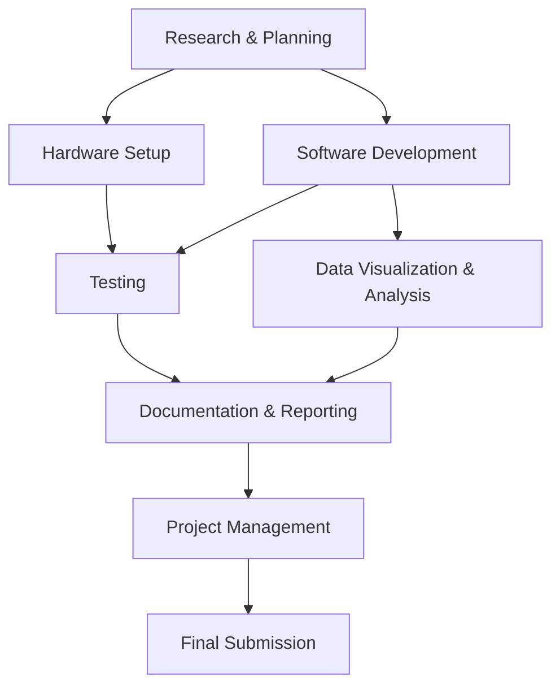

# Edge Computing Indoor Navigation Project Tasks

This index links to all task categories for the research project on improving indoor navigation using ultra-wideband sensors, RFID technology, and edge computing.

## Task Categories

- [[01-Research-and-Planning|Research & Planning]]
- [[02-Hardware-Setup|Hardware Setup]]
- [[03-Software-Development|Software Development]]
- [[04-Data-Visualization-and-Analysis|Data Visualization & Analysis]]
- [[05-Testing|Testing]]
- [[06-Documentation-and-Reporting|Documentation & Reporting]]
- [[07-Project-Management|Project Management]]

## Project Overview

## Timeline Highlights

- Research & Setup: 2 weeks
- Development: 3 weeks
- Testing: 2 weeks
- Documentation & Final Preparation: 1.5 weeks

## Project Goals

- Improve indoor navigation using stationary sensors
- Process mapping data at edge nodes
- Combine individual maps at central node
- Validate performance improvements over traditional approaches
