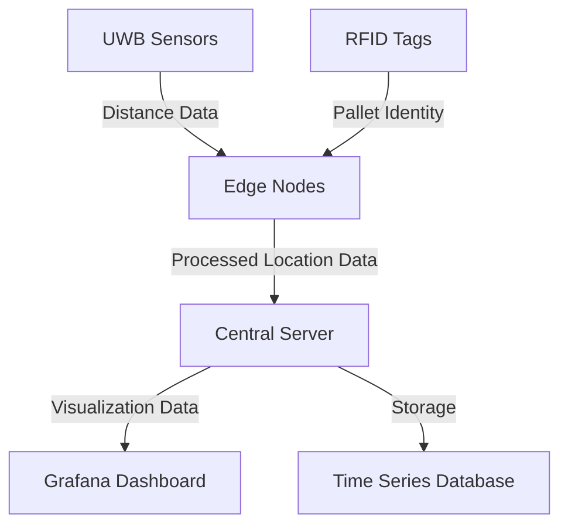

# UWB-RFID Indoor Positioning System

This repository contains the implementation of an indoor positioning system using Ultra-Wideband (UWB) sensors and RFID technology for pallet tracking in warehouse environments.

## Project Overview

The system uses four UWB sensors positioned in the corners of a room to create a coordinate system, combined with RFID tags attached to pallets. Edge computing nodes process the sensor data locally, and the results are visualized through Grafana dashboards.

## System Architecture

## Directory Structure

- `hardware/` - Hardware setup guides and configurations
- `uwb/` - UWB sensor interface and trilateration code
- `rfid/` - RFID reader interface and tag management
- `edge/` - Edge node processing and data handling
- `server/` - Central server code for data aggregation
- `visualization/` - Grafana dashboard templates and configurations
- `testing/` - Test procedures and evaluation metrics
- `docs/` - Detailed documentation on system components

## Getting Started

See the [Installation Guide](docs/installation.md) for detailed setup instructions.

## Research Methodology

This system is designed to evaluate the performance benefits of edge computing for indoor positioning systems. Key metrics include:

- Positioning accuracy (cm)
- System latency (ms)
- Processing load distribution
- Bandwidth utilization
- Scalability characteristics

## Requirements

- Python 3.9+
- Raspberry Pi devices (or similar)
- UWB sensor modules (4+)
- RFID readers and tags
- InfluxDB for time series data
- Grafana for visualization
